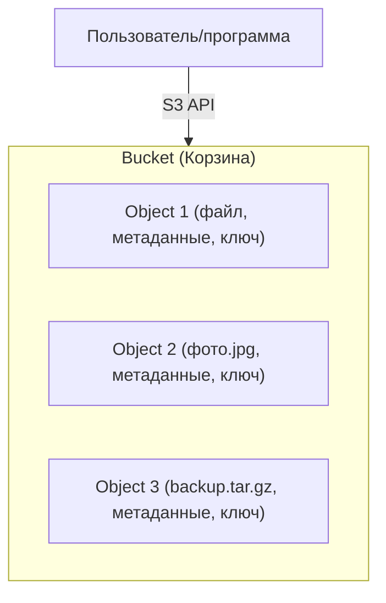
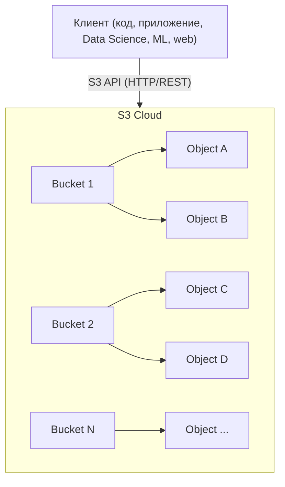
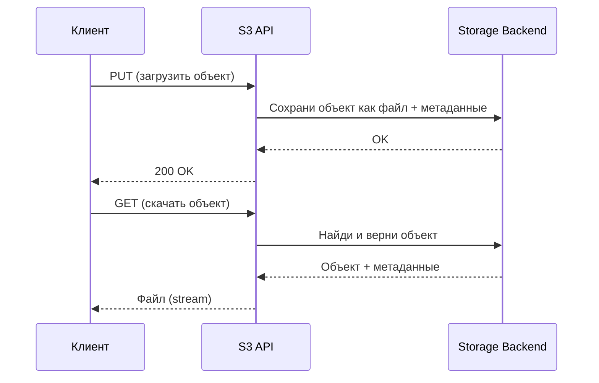

# S3 как стандарт

🪣 В этом [видео](https://youtu.be/Vfe5H3bD2SQ) ты узнаешь, что такое S3 и объектное хранилище — фундаментальные
технологии для работы с большими данными и современной дата-инженерии.

💼 Хочешь ускорить рост в карьере? Я предлагаю менторство по дата-инженерии и IT-консультации:

- Менторство: https://korsak0v.notion.site/Data-Engineer-185c62fdf79345eb9da9928356884ea0
- Консультации: https://korsak0v.notion.site/Data-Engineer-185c62fdf79345eb9da9928356884ea0

Я объясню:

- Как устроено объектное хранилище и чем оно отличается от файлового и блочного
- Почему S3 стал стандартом для хранения данных в облаках
- Основные принципы архитектуры S3: buckets, объекты, ключи и метаданные
- Как работает S3 API и как использовать его на практике
- Реальные примеры работы с S3: создание бакетов, загрузка и чтение данных
- Где применяется S3: Data Lake, резервные копии, ML, Big Data

Это видео — твоя база для старта в data engineering, аналитике и работе с облачными хранилищами.

Ссылки:

- Менторство/консультации по IT – https://korsak0v.notion.site/Data-Engineer-185c62fdf79345eb9da9928356884ea0
- TG канал – https://t.me/DataLikeQWERTY
- Instagram – https://www.instagram.com/i__korsakov/
- Habr – https://habr.com/ru/users/k0rsakov/publications/articles/
- Git-репозиторий из видео – https://github.com/k0rsakov/pet_project_s3_as_standard

Подписывайся, если хочешь разбираться в практических инструментах дата-инженера! Оставляй комментарии — расскажи, как ты
используешь S3 или с какими вопросами сталкивался.

Тайминги:
- 00:00 – Начало
- 01:10 – Классические типы хранения
- 03:39 – Что такое S3?
- 04:45 – Как устроено объектное хранилище?
- 06:30 – Ключевые особенности объектного хранилища
- 08:35 – Почему S3 так популярен?
- 09:58 – Общая архитектура
- 10:50 – Ключевые элементы архитектуры
- 11:59 – Как выглядит взаимодействие
- 12:47 – Как обеспечивается надёжность
- 14:07 – Важно знать про S3
- 15:09 – Демонстрация на практике
- 17:42 – Просмотр списка бакетов (bucket)
- 21:14 – Просмотр списка объектов (object)
- 22:19 – Загрузка объекта в S3
- 23:00 – Просмотр списка объектов (object) после загрузки
- 23:38 – Создание и удаление бакета (bucket)
- 24:40 – Создание бакета (bucket)
- 25:04 – Просмотр списка бакетов после создания нового (bucket)
- 25:28 – Загрузка данных в S3 при помощи DuckDB
- 26:40 – Просмотр списка объектов (object) после загрузки при помощи DuckDB
- 26:58 – Чтение данных из S3 при помощи DuckDB
- 27:43 – Загрузка данных в S3 при помощи Pandas
- 28:46 – Просмотр списка объектов (object) после загрузки при помощи Pandas
- 29:17 – Чтение данных из S3 при помощи Pandas
- 29:37 – Один S3 API для всех объектных хранилищ
- 30:04 – Просмотр веб-интерфейсов для объектных хранилищ

#S3 #объектноехранилище #dataengineering #датаинженер #облачные_технологии #BigData #ML #Python #PetProject #MinIO #Ceph

## Создание виртуального окружения

```bash
python3.12 -m venv venv && \
source venv/bin/activate && \
pip install --upgrade pip && \
pip install poetry && \
poetry lock && \
poetry install
```

### Добавление новых зависимостей в окружение

```bash
poetry lock && \
poetry install
```

### Добавление зависимости в pyproject.toml

```bash
poetry add <package_name>=<version>
```

## Разворачивание инфраструктуры

```bash
docker-compose up -d
```

## Получение файла для загрузки в S3

Выполнить в корне проекта:

```bash
curl -LfO https://raw.githubusercontent.com/datasciencedojo/datasets/master/titanic.csv 
```

## Что такое объектное хранилище и S3?

### Классические типы хранения

- **Файловое хранилище** (File Storage):
    - Файлы хранятся в папках и подчиняются файловой структуре (например, папка/файл.txt).
    - Хорошо подходит для мелких файлов, домашнего использования и рабочих станций.
- **Блочное хранилище** (Block Storage):
    - Данные разбиты на блоки фиксированного размера (например, жёсткий диск, SSD, iSCSI).
    - Используется для баз данных, виртуальных машин, когда важна скорость.
- **Объектное хранилище** (Object Storage):
    - Данные хранятся в виде "*объектов*".
    - Каждый `объект` = `файл` + `метаданные` + `уникальный ключ` (имя/идентификатор).
    - Структуры папок нет, есть "бакеты" (buckets), как большие контейнеры.

### Что такое S3?

- **S3 (Simple Storage Service)** — сервис для объектного хранения.
- S3 – это стандарт де-факто для облачного хранения больших объёмов данных:
    - Логи, резервные копии, большие датасеты, фото и видеоархивы, data lake.
- **S3 API** – набор стандартных HTTP-запросов для работы с объектами (`PUT`, `GET`, `DELETE` и т.п.).
- Идея S3 скопирована и реализована многими облаками: MinIO, Selectel, VK Cloud, Yandex Cloud, Google Cloud Storage,
  etc.

### Как устроено объектное хранилище?


```mermaid
flowchart TB
    subgraph Bucket ["Bucket (Корзина)"]
        A1["Object 1 (файл, метаданные, ключ)"]
        A2["Object 2 (фото.jpg, метаданные, ключ)"]
        A3["Object 3 (backup.tar.gz, метаданные, ключ)"]
    end
    User["Пользователь/программа"] -- S3 API --> Bucket
```

- **Bucket** — контейнер для объектов (можно представить как папку верхнего уровня).
- **Object** — любые данные (файл), которые хранятся внутри bucket.
- **Метаданные** — информация о файле (дата, тип, кастомные теги и пр.).
- **Ключ (key)** — уникальное имя объекта внутри bucket (например, `2024/photos/image1.jpg`).

### Ключевые особенности объектного хранилища

- Нет реальной древовидной файловой структуры (всё хранится "*плоско*", но ключи могут имитировать пути).
- Масштабируется до триллионов объектов.
- Дешёвое и надёжное хранение.
- Хорошо подходит для:
    - Data Lake
    - Backup
    - Big Data
    - Архивов
    - ML/DL задач.
- Доступ по интернету (REST API / S3 API).

### Почему S3 так популярен?

- **Открытый стандарт** — легко мигрировать между разными облаками и on-premises.
- **Масштабируемость** и высокая доступность.
- **Гибкая настройка доступа** (IAM, политики, временные ссылки).
- **Поддержка большого числа инструментов и библиотек** (pandas, boto3, minio-py, s3cmd и др).

### Общая архитектура


```mermaid
flowchart TB
    subgraph S3_Cloud ["S3 Cloud"]
        B1["Bucket 1"]
        B2["Bucket 2"]
        B3["Bucket N"]
        B1 --> O11["Object A"]
        B1 --> O12["Object B"]
        B2 --> O21["Object C"]
        B2 --> O22["Object D"]
        B3 --> O31["Object ..."]
    end
    user["Клиент (код, приложение, Data Science, ML, web)"]
    user -- " S3 API (HTTP/REST) " --> S3_Cloud
```

### Ключевые элементы архитектуры

- **Бакеты (Buckets):**
    - Логические контейнеры для хранения объектов.
    - В каждом бакете могут быть миллионы и даже миллиарды объектов.
    - Название бакета уникально в пределах облака.
- **Объекты (Objects):**
    - Каждый объект — это файл + метаданные + уникальный ключ (имя, например: `data/2024/report.csv`).
    - В отличие от файловых систем, нет реальных папок — только имитация через ключи.
- **S3 API (REST/HTTP):**
    - Вся работа с хранилищем происходит через стандартные HTTP-запросы: `PUT`, `GET`, `DELETE`, `LIST` и др.
    - Всё, что нужно — это `endpoint`, ключи доступа, имя бакета и имя объекта.

### Как выглядит взаимодействие

1. **Клиент (ваш код, pandas, boto3, minio-py, ML pipeline)**  
   → Отправляет запрос (например, загрузить файл или получить список объектов).
2. **S3 Gateway (front, API endpoint)**  
   → Получает запрос, авторизует и аутентифицирует пользователя (по ключам).
3. **Storage Backend**  
   → Физически хранит объекты (диски, кластер серверов, репликация, шардирование).
4. **Ответ клиенту**  
   → Возвращает результат (файл, статус, список объектов и т.д.).


```mermaid
sequenceDiagram
    participant User as Клиент
    participant S3 as S3 API
    participant Storage as Storage Backend
    User ->> S3: PUT (загрузить объект)
    S3 ->> Storage: Сохрани объект как файл + метаданные
    Storage -->> S3: OK
    S3 -->> User: 200 OK
    User ->> S3: GET (скачать объект)
    S3 ->> Storage: Найди и верни объект
    Storage -->> S3: Объект + метаданные
    S3 -->> User: Файл (stream)
```

### Как обеспечивается надёжность

- **Репликация:** Данные автоматически копируются на несколько серверов или даже в разные дата-центры.
- **Версионирование:** Можно включить хранение всех версий файла.
- **Политики доступа и шифрование:** Доступ через IAM, ACL, шифрование «на лету» и «на диске».

### Demo

1) Показать какие бакеты есть и показать, что оба клиента работают успешно для всех S3 – `list_bucket.py`
2) Показать, что все бакеты пустые и там нет объектов – `list_objects.py`
3) Положить файл c данными титаника в S3 бакеты – `upload_object.py`
4) Показать, что в бакетах появились объекты – `list_objects.py`
5) Создать и удалить бакеты – `create_remove_bucket.py`
6) Создать бакеты – `create_bucket.py`
7) Показать текущие бакеты - `list_bucket.py`
8) Загрузить данные при помощи DuckDB – `duckdb_copy_to_s3.py`
9) Прочитать данные при помощи DuckDB – `duckdb_read_from_s3.py`
10) Загрузить данные при помощи Pandas – `pandas_dataframe_to_s3.py`
11) Прочитать данные при помощи Pandas – `pandas_dataframe_from_s3.py`
12) Показать, что всё что мы писали есть в бакетах – `list_objects.py`
